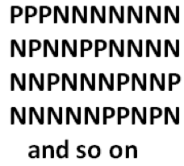
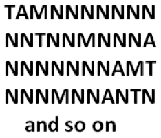
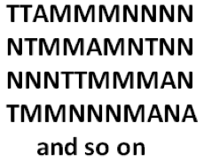

# 1.1 Три разные задачи, которые на самом деле одна и та же!

> Source: [gdaymath.com](https://gdaymath.com/lessons/perms-1/1-1-three-different-problems/)

[Спасибо Джеймсу Ки за идею этого вступления.]

Вот три задачи:

1. **В офисе десять человек. Их начальник однажды решает случайно выбрать трех человек и повысить каждого из них. Сколько существует различных возможных групп из трех человек?**

2. *В офисе десять человек. Их начальник однажды решает случайно выбрать трех человек и повысить каждого из них. Первый выбранный получит высшее повышение, второй — среднее, а третий — минимальное. Сколькими различными способами можно распределить эти повышения?*

3. *В офисе десять человек. Их начальник однажды решает случайно выбрать шесть человек и повысить каждого из них. Двое получат высшее повышение, один — среднее, и трое — минимальное. Сколькими различными способами можно распределить эти повышения?*

Метод решения каждой задачи одинаков.

Представьте, что все десять сотрудников стоят в ряд.

В первой задаче начальник называет трех человек «повышенными» (P — Promoted) и семерых «не повышенными» (N — Not promoted). Нам нужно подсчитать все способы, которыми она может присвоить эти метки десяти людям в ряду. Список возможностей, каждая из которых представляет собой метки, присвоенные в этом ряду, выглядит так:

Итак, чтобы ответить на вопрос, нам нужно подсчитать количество «слов», состоящих из трех букв P и семи букв N.

Во второй задаче начальник называет одного человека «высшее повышение» (T — Top), одного «среднее повышение» (A — Average), одного «минимальное повышение» (M — Minimal) и семерых «не повышенными» (N). Нам нужно подсчитать все способы, которыми она может присвоить эти метки десяти людям в ряду. Список возможностей выглядит так:

Итак, чтобы ответить на вопрос, нам нужно подсчитать количество «слов», состоящих из одной T, одной A, одной M и семи букв N.

В третьей задаче начальник называет двух человек «высшее повышение» (T), одного «среднее повышение» (A), трех «минимальное повышение» (M) и четырех «не повышенными» (N). Нам нужно подсчитать все способы, которыми она может присвоить эти метки десяти людям в ряду. Список возможностей выглядит так:

Итак, чтобы ответить на вопрос, нам нужно подсчитать количество «слов», состоящих из двух букв T, одной A, трех букв M и четырех букв N.

Все три задачи по сути одинаковы: *Сколькими способами мы можем переставить буквы в слове?*

**Присвоение меток в задаче на подсчет делает все задачи на подсчет идентичными!**

Так что наша задача в этом курсе — просто научиться подсчитывать перестановки букв в словах!