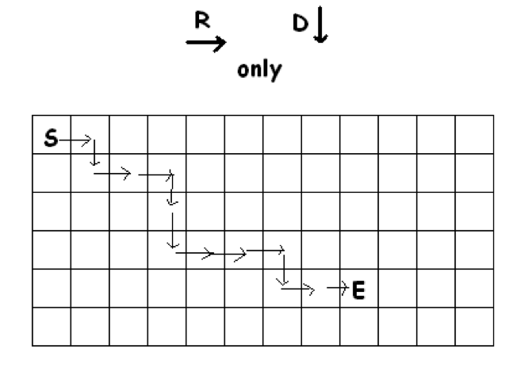
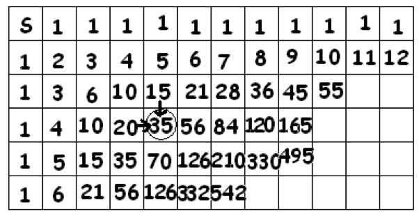

# 3.1 Сетка чисел

> Source: [gdaymath.com](https://gdaymath.com/lessons/perms-1/2-1-grid-numbers/)

Вот знаменитая головоломка: Начиная с верхней левой клетки, отмеченной S, и делая горизонтальные шаги только вправо или вертикальные шаги только вниз, сколько существует различных путей к клетке, отмеченной E?

Поиграйте с этой головоломкой немного, прежде чем читать дальше. Играя, возможно, поразмышляйте над следующими вопросами:

1.  Учитывая расположение точки E, не является ли сетка, показанная на диаграмме, неоправданно большой?
2.  Отмечать разные пути от S до E ужасно сложно. Можно было бы сначала посчитать пути к разным клеткам, с которыми легче справиться, и поискать закономерности. Например, сколько существует различных путей от S до любой клетки в верхней строке? Запишите ответы в эти клетки. Сколько различных путей ведут в любую клетку в крайнем левом столбце? В клетки во второй строке? Во втором столбце? В третьей строке?
3.  Если вы готовы довериться закономерностям, можете ли вы сделать хорошее предположение относительно ответа на исходную головоломку?

Есть два способа подойти к этой головоломке.

**ПОДХОД НОМЕР 1: ФОРМУЛЫ**

Каждый путь от S до E можно описать последовательностью букв П (Право) и В (Вниз) [в оригинале R и D]. Например, путь, указанный на диаграмме, можно описать последовательностью:
П В П П В В П П П В П П (RDRRDDRRRDRR)

Эта последовательность содержит восемь букв П и четыре буквы В. Более того, любая последовательность из восьми П и четырех В соответствует пути от S до E.

**Практика:** Отметьте на диаграмме пути, заданные последовательностями В В П П П П П В П П П В и П П П П П П П П В В В В.

Таким образом, количество путей от S до E совпадает с количеством способов переставить двенадцать букв: восемь П и четыре В. (То есть пометить двенадцать слотов восемью П и четырьмя В). Ответ на исходную головоломку:
$\dfrac{12!}{8!4!} = 495$ путей.

**Упражнение 32:** Сколько путей существует от S до нижней правой клетки сетки?

**Упражнение 33:** Предположим, что клетка E находится на $a$ шагов правее S и на $b$ шагов ниже S. Покажите, что количество путей от S до E задается формулой:
$\dfrac{(a+b)!}{a!b!}$.

Пронумеруем строки 0, 1, 2, … (верхняя строка — нулевая, соответствует «нулю шагов вниз») и столбцы 0, 1, 2, … (крайний левый столбец — нулевой, соответствует «нулю шагов вправо»).

Клетка E на исходной диаграмме имеет позицию: строка 4, столбец 8.
Количество путей к ней равно $\dfrac{12!}{4!8!}$. Это количество способов расположить 4 буквы В и 8 букв П.

В общем случае, нумеруя строки и столбцы таким образом, клетка в строке $a$ и столбце $b$ (в моих обозначениях выше это $b$ и $a$ соответственно, но давайте следовать формуле) требует $a$ шагов в одну сторону и $b$ шагов в другую.
Если использовать обозначения из текста:
Пусть $a$ — шаги вправо (столбцы), $b$ — шаги вниз (строки).
Тогда формула $\dfrac{(a+b)!}{a!b!}$ верна.

Обратите внимание, что эта формула верна для ячеек в верхней строке, которые требуют $b=0$ шагов вниз, и для ячеек в левом столбце с $a=0$ шагов вправо:
$\dfrac{(a+0)!}{a!0!} = \dfrac{a!}{a!0!} = 1$
$\dfrac{(0+b)!}{0!b!} = \dfrac{b!}{0!b!} = 1$
(Слава богу, мы установили $0!=1$.)

Обратите внимание, что для верхней левой ячейки прямо в позиции S мы получаем:
$\dfrac{(0+0)!}{0!0!} = \dfrac{0!}{0!0!} = 1$.
Очевидно, математика подсказывает, что есть один способ начать в S и закончить в S — просто оставаться на месте!

**ПОДХОД 2: ЗАКОНОМЕРНОСТИ**

Если вы впишете ответы для количества путей в каждую клетку, появится следующая сетка чисел:

(Упражнение 32 предлагает, что позиции, помеченной S, также следует присвоить число 1.)

**Упражнение 34:** Объясните, почему таблица симметрична относительно юго-восточной диагонали.

У нас есть формула $\dfrac{(a+b)!}{a!b!}$ для записи в $a$-й строке и $b$-м столбце (начиная отсчет с нуля).

Заметили ли вы, что каждая запись во внутренней клетке является суммой двух чисел — числа прямо над клеткой и числа прямо слева от клетки? Это имеет смысл с точки зрения подсчета путей.

Рассмотрим обведенную клетку. Чтобы попасть в эту клетку, можно либо сначала попасть в клетку прямо над ней — есть 15 способов сделать это — и затем спуститься вниз, либо попасть в клетку прямо слева от нее — есть 20 способов сделать это — и затем шагнуть вправо. Это дает в общей сложности $15 + 20 = 35$ путей к обведенной клетке.

**Практика:** Используйте это наблюдение, чтобы заполнить остальную часть таблицы.
