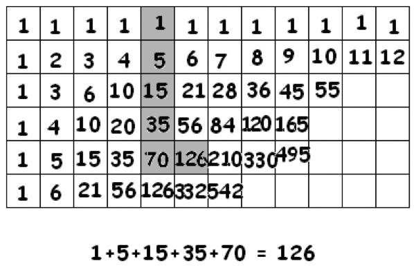

# 3.2 Свойство чулка

> Source: [gdaymath.com](https://gdaymath.com/lessons/perms-1/2-2-stocking-property/)

Эта сетка чисел обладает рядом любопытных свойств. Первое из них мы рассмотрим здесь.

Начните с любой «1» в верхней строке, спуститесь вниз на любое количество клеток, а затем поверните направо на одну клетку, чтобы получился «чулок».

Число в «носке» чулка всегда равно сумме чисел в «голенище» чулка.

Существует также горизонтальная версия этого свойства чулка.

**Упражнение 35:** Объясните, почему работает свойство чулка.

**ПОДСКАЗКА:** Используйте тот факт, что число в носке на самом деле является суммой двух других чисел в сетке.

Ответ приведен в СОПУТСТВУЮЩЕМ РУКОВОДСТВЕ к этому курсу по Перестановкам и Сочетаниям.

### Практика: Охота за чулками

**Упражнение 36:**
Рассмотрите «голенище» чулка, состоящее из следующих пяти чисел в одном из столбцов сетки (начиная с верхней 1):
$1, 4, 10, 20, 35$.
Где в сетке находится «носок» для этого чулка и какому числу он равен? Проверьте это сложением.

**Упражнение 37 (Сюжетное):**
Муравей ползет по сетке треугольника Паскаля. Он начинает в самой верхней точке $S(0,0)$ и спускается строго вниз по левой диагонали из единиц до 7-й строки (считая от 0). На каждом шагу он записывает число в клетке, где побывал. В конце пути он делает один резкий поворот направо. Чему будет равно число в клетке, куда он попал после поворота? Чему равна сумма всех выписанных муравьем чисел?

**Упражнение 38 (Нетипичная задача):**
Вася нашел в таблице часть «чулка», но верхняя его часть (с единицами) оказалась стерта. Остались только числа:
$10, 15, 21, 28$.
Эти числа идут подряд по одной из диагоналей (как в свойстве чулка). Вася утверждает, что их сумма равна числу «в носке» (84), которое стоит в следующей строке справа.
1. Прав ли Вася? 
2. Если сумма не равна 84, то как найти правильную сумму этих четырех чисел, используя свойство чулка и вычитание?

---
**Ответы:**
36. Число 70. Оно находится в следующей строке, на один шаг вправо от числа 35. (Сумма: $1+4+10+20+35 = 70$).
37. Сумма 8 единиц равна 8. Число в «носке» также будет 8.
38. 1. Нет, Вася не учел, что свойство чулка работает только если начинать с 1. 2. Нужно из «носка» для полного чулка (84) вычесть сумму недостающей верхушки ($1 + 3 + 6 = 10$). Ответ: $84 - 10 = 74$.

