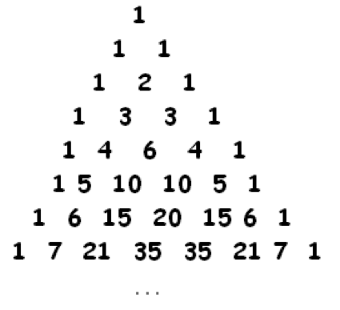
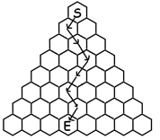
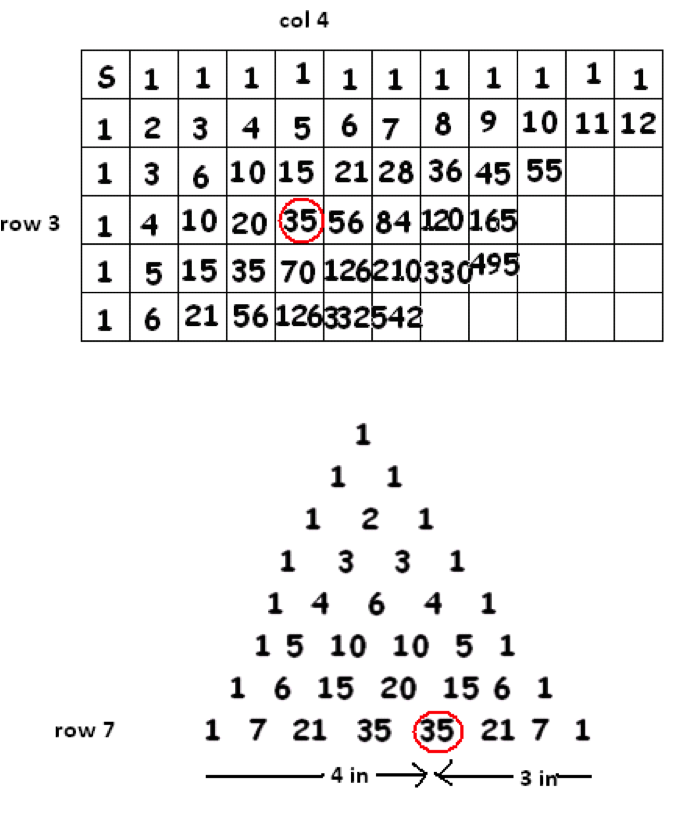

# 3.3 Треугольник Паскаля

> Source: [gdaymath.com](https://gdaymath.com/lessons/perms-1/2-3-pascals-triangle/)

Поверните сетку чисел на сорок пять градусов, чтобы получился треугольник чисел:



Представленная таким образом сетка была прославлена французским математиком Блезом Паскалем (1623–1662) благодаря его работам в теории вероятностей. Каждая строка этого треугольника является диагональю исходной сетки, и каждое число в треугольнике подсчитывает пути. (Если хотите, мы можем сделать это более наглядным, подсчитывая пути, идущие вниз в пчелиных сотах).



Как и прежде, КАЖДОЕ ВНУТРЕННЕЕ ЧИСЛО ТРЕУГОЛЬНИКА ПАСКАЛЯ РАВНО СУММЕ ДВУХ ЧИСЕЛ НАД НИМ.

У нас также есть формулы для отдельных чисел треугольника Паскаля. Число, которое находилось в $a$-й строке и $b$-м столбце исходной сетки (начиная отсчет с нулевых строк и нулевых столбцов), теперь находится в $(a+b)$-й строке треугольника Паскаля, на $a$ позиций слева и на $b$ позиций справа вдоль этой строки.



Рассматривайте верхнюю строку (состоящую из единственной 1) как нулевую строку треугольника. Формула для числа в строке $n$, находящегося на $a$ позиций слева и на $b$ позиций справа, такова:
$\dfrac{n!}{a!b!}$.
(И $n$ действительно равно $a+b$).

### Практика: Тайны треугольника

**Упражнение 39:**
Используя формулу $\frac{n!}{a!b!}$, найдите число, которое стоит в 8-й строке треугольника Паскаля (считая сверху от нулевой строки) в 3-й позиции слева ($a=3, b=5$).

**Упражнение 40:**
Какое число в 10-й строке треугольника является самым большим? Проверьте его значение по формуле.

**Упражнение 41 (Сюжетное):**
Пчела начинает свой путь в самой верхней соте (строка 0) и хочет спуститься в соты в 5-й строке (считая от 0). Сколько различных маршрутов ведут в любую из двух центральных сот 5-й строки?

**Упражнение 42 (Нетипичная задача):**
Представьте, что в 4-й строке треугольника Паскаля (строка: 1, 4, 6, 4, 1) центральная сота с числом **6** оказалась занята злым шершнем. Пчела, спускаясь из самой верхней соты вниз, должна облетать эту соту.
Сколько всего безопасных путей существует у пчелы, чтобы достичь **любой** соты в 6-й строке?

_Подсказка: Вы не можете использовать формулу $2^n$ для всей строки, так как часть путей оборвалась. Используйте метод сложения «от соты к соте», ставя 0 на месте шершня._

```text
       1       (строка 0)
      1 1
     1 2 1
    1 3 3 1
   1 4 X 4 1   <-- X это шершень (вместо 6)
  . . . . . .
 . . . . . . . (строка 6)
```

---

**Ответы:**

<!-- 39. 56. -->
<!-- 40. 252. (Это число $\frac{10!}{5!5!}$ в середине 10-й строки). -->
<!-- 41. В каждую из двух центральных сот ведут по 10 маршрутов ($\binom{5}{2}$ и $\binom{5}{3}$). -->
<!-- 42. 40 путей. (Без шершня сумма была бы $2^6 = 64$. Составив треугольник вручную, вы получите в 6-й строке числа: 1, 6, 9, 8, 9, 6, 1. Их сумма равна 40). -->
