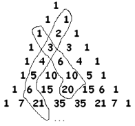
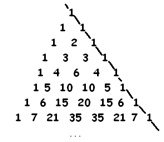
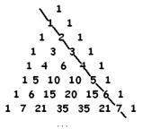

# 3.6 Много практики

> Source: [gdaymath.com](https://gdaymath.com/lessons/perms-1/2-6-lots-practice/)

**Упражнение 38:** Вычислите степени $1.01^0, 1.01^1, 1.01^2, 1.01^3, 1.01^4$ и $1.01^5$. Что вы заметили? Объясните, что вы заметили.

**Упражнение 39:** Без калькулятора вычислите $2.01^3$.

**Упражнение 40:**
а) Не выполняя никаких арифметических действий, объясните, почему
$64 – 6 \cdot 32 + 15 \cdot 16 – 20 \cdot 8 + 15 \cdot 4 – 6 \cdot 2 + 1$
должно равняться 1.

б) Скажите что-нибудь интересное, что можно вывести из рассмотрения $(3 -1)^n$.

**Упражнение 41:**
Вот треугольник Паскаля:

Свойство чулка можно интерпретировать следующим образом:
Выберите любую цифру «1» на стороне треугольника и следуйте по диагонали от этой цифры внутрь треугольника. Поверните вниз на девяносто градусов, чтобы сформировать носок чулка. Тогда число в носке равно сумме чисел в голенище чулка.

Убедитесь сами — еще раз — что это свойство верно.

а) Числа на самой правой диагонали треугольника Паскаля: 1 1 1 1 1 1…

Объясните, почему свойство чулка говорит нам, что числа следующей диагонали треугольника Паскаля должны быть: 1 2 3 4 5 ….

б) Зная, что вторая диагональ треугольника Паскаля содержит числа 1 2 3 4 5 6 …

объясните, используя свойство чулка, почему числа следующей диагонали треугольника Паскаля должны быть треугольными числами: 1 3 6 10 15 21 ….

в) Используйте свойство чулка, чтобы быстро определить сумму первых шести треугольных чисел.

г) Сумма первых шести треугольных чисел называется шестым тетраэдрическим числом. Что такое тетраэдр? Почему это название уместно?

д) Используйте треугольник Паскаля, чтобы найти сумму первых шести тетраэдрических чисел.

**Упражнение 42:** Не используя калькулятор, вычислите $99^3$. (Подсказка: $99 = 100 - 1$. Используйте коэффициенты из 3-й строки треугольника Паскаля: 1, 3, 3, 1).

**Упражнение 43:**
а) Найдите сумму чисел в строках 0, 1, 2, 3 и 4 треугольника Паскаля. Какую закономерность вы видите?
б) Используя разложение $(1+1)^n$, объясните, почему эта закономерность сохраняется навсегда.

**Упражнение 44:** Следующая диагональ в треугольнике Паскаля (после тетраэдрических чисел) представляет собой числа, которые являются суммами тетраэдрических чисел. Эти числа называются «пентатопными» (или числами 4-симплекса). Найдите первые пять пентатопных чисел.
