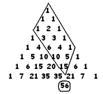
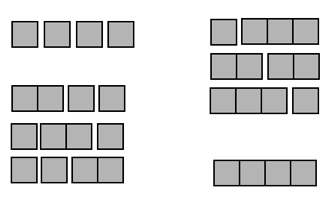

# 3.7 Исследование: Параллелограммы и Мультиномы

> Source: [gdaymath.com](https://gdaymath.com/lessons/perms-1/3-7-yet-practice/)

Сегодня мы расширим наши горизонты. Мы не только найдем новые геометрические фигуры внутри треугольника Паскаля, но и научимся возводить в степень не только двойки (биномы), но и тройки (триномы)!

### Пример с решением: Возведение в степень тройки

**Задача:** Найдите коэффициент при $x^2 y z^2$ в разложении $(x + y + z)^5$.

**Решение:**
Когда мы возводим в степень сумму трех слагаемых, мы выбираем по одной переменной из каждой из 5 скобок. Чтобы получить $x^2 y z^2$, нам нужно выбрать $x$ из двух скобок, $y$ из одной и $z$ из оставшихся двух.

Это задача на перестановки с повторениями! Нам нужно расставить 2 буквы $x$, 1 букву $y$ и 2 буквы $z$ на 5 позиций.
Формула количества таких способов (мультиномиальный коэффициент):
$$\frac{n!}{a!b!c!} = \frac{5!}{2!1!2!}$$

Вычислим:
$$\frac{5 \cdot 4 \cdot 3 \cdot 2 \cdot 1}{(2 \cdot 1) \cdot 1 \cdot (2 \cdot 1)} = \frac{120}{4} = 30$$

**Ответ:** 30.

---

### Практика: Геометрия и Комбинаторика

#### Свойство параллелограмма

**Упражнение 1:** 
Выберите любое число в треугольнике Паскаля (например, «15»). Сформируйте параллелограмм из чисел над ним, как показано на рисунке.

Просуммируйте все числа в этом параллелограмме. Вы заметите, что сумма на единицу меньше, чем число, находящееся на две строки ниже выбранного вами («под ним»).
*Пример: Сумма в параллелограмме над 15 равна 55, что на единицу меньше 56.*

а) Проверьте это свойство для другого числа.
б) **Подсказка:** Попробуйте представить параллелограмм как набор параллельных «чулков» (свойство из прошлого занятия). Видите ли вы теперь, почему это работает?

#### Мультиномиальная теорема

**Упражнение 2:** 
Предположим, мы раскрываем скобки в выражении $(x+y+z)^7$.
а) Сколько раз встретится член $y^7$?
б) Сколько раз встретится член $x z^6$?
в) Сколько раз встретится член $x^2 y^3 z^2$?
г) Попробуйте записать общую формулу для коэффициента при $x^a y^b z^c$.

**Упражнение 3:** 
Сформулируйте «квадрономиальную» теорему: какой будет коэффициент при $x^a y^b z^c w^d$ в разложении $(x+y+z+w)^n$?

#### Загадка поездов

**Упражнение 4:** 
У Салли есть бесконечный запас блоков длиной 1, 2, 3 и так далее. Она строит из них «поезда» определенной длины. Салли заметила, что существует 8 различных поездов длиной 4.

Она также подсчитала количество поездов в зависимости от числа блоков:
- 1 поезд из 4 блоков (1+1+1+1)
- 3 поезда из 3 блоков (2+1+1, 1+2+1, 1+1+2)
- 3 поезда из 2 блоков (3+1, 1+3, 2+2)
- 1 поезд из 1 блока (4)

а) Нарисуйте (или выпишите составы) всех поездов длиной 5. Сгруппируйте их по количеству используемых блоков.
б) Какую связь с треугольником Паскаля вы здесь видите? Почему количество поездов длиной $n$ всегда будет степенью двойки?

---

### Домашнее задание

1. Найдите коэффициент при $a^2 b^2 c^2$ в разложении $(a + b + c)^6$.
2. Используя свойство параллелограмма, найдите сумму всех чисел в треугольнике Паскаля от 0-й до 5-й строки включительно.
3. **Сложная задача:** Сколькими способами можно составить «поезд» Салли длиной 6, если использовать ровно 3 блока? Сверьте ответ с треугольником Паскаля.

---

**Ответы:**

<!-- 
1. 6! / (2!2!2!) = 720 / 8 = 90.
2. Сумма строк: 1 + 2 + 4 + 8 + 16 + 32 = 63. По свойству параллелограмма (если достроить) или просто как сумма степеней двойки.
3. Это выбор 2-х мест для "разрезов" между 6-ю вагонами. C(5, 2) = 10. В треугольнике Паскаля это число из 5-й строки (1 5 10 10 5 1).

Практика:
2. а) 1 раз (7!/0!7!0!). б) 7 раз (7!/1!0!6!). в) 7!/(2!3!2!) = 5040 / (2*6*2) = 210.
4. а) Для длины 5: 1 (5 блоков), 4 (4 блока), 6 (3 блока), 4 (2 блока), 1 (1 блок). Всего 16 = 2^4.
-->
