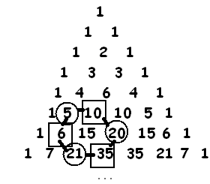
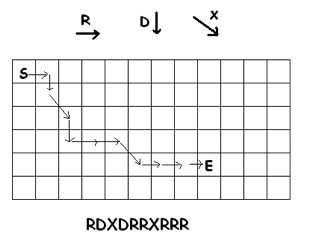

# 3.8 Финальное погружение: Звезды и Перегородки

> Source: [gdaymath.com](https://gdaymath.com/lessons/perms-1/3-8-still-yet-practice/)

На этом занятии мы изучим один из самых мощных методов комбинаторики — выбор с повторениями, а также увидим фрактальную природу треугольника Паскаля.

### Пример с решением: Метод «Шаров и Перегородок»

**Задача:** Сколькими способами можно выбрать 3 фрукта в магазине, если там продаются только яблоки и груши? (Порядок не важен, количество яблок и груш неограничено).

**Решение:**
Представьте наш выбор как ряд из 3 предметов (фруктов) и одной перегородки, которая разделяет яблоки от груш.
Например:

- `ОО|О` — 2 яблока и 1 груша.
- `|ООО` — 0 яблок и 3 груши.
- `ООО|` — 3 яблока и 0 груш.

Всего у нас $3 + 1 = 4$ позиции. Нам нужно выбрать 1 позицию для перегородки (или 3 для фруктов).
Количество способов: $\binom{4}{1} = 4$ или $\binom{4}{3} = 4$.

Общая формула для выбора $k$ объектов из $n$ типов с повторениями (обозначается $\left(\!\binom{n}{k}\!\right)$):
$$\left(\!\binom{n}{k}\!\right) = \binom{n + k - 1}{k}$$

**Ответ:** 4.

---

### Практика: Глубокие закономерности

#### Выбор с повторениями

**Упражнение 1:**
Используя формулу из примера, вычислите:
а) $\left(\!\binom{3}{3}\!\right)$ (выбор 3 объектов из 3 типов). Проверьте, что получается 10.
б) $\left(\!\binom{3}{5}\!\right)$. Проверьте, что получается 21.

**Упражнение 2:**
Нарисуйте таблицу значений $\left(\!\binom{n}{k}\!\right)$ для $n = 1, 2, 3$ и для $k = 0, 1, 2, 3$.
Видите ли вы эти числа в обычном треугольнике Паскаля? Где именно они находятся?

#### Фракталы и Четность

**Упражнение 3:**
Рассмотрите первые 8 строк треугольника Паскаля.
а) Обведите все нечетные числа. Какую фигуру они напоминают?
б) В каких строках треугольника Паскаля **все** числа нечетные? Попробуйте найти закономерность (номера строк: 0, 1, 3, 7...).

**Упражнение 4 (Шестиугольник):**
Выберите любое внутреннее число треугольника Паскаля и рассмотрите шесть чисел вокруг него.

Возьмите произведение чередующихся чисел в этом шестиугольнике (через одно).
_Пример: $5 \cdot 20 \cdot 21 = 2100$ и $10 \cdot 35 \cdot 6 = 2100$._

а) Проверьте это свойство для другого «цветка».
б) **Сложная задача:** Докажите, что эти произведения всегда равны.
_Подсказка: Обозначьте центральное число как $\binom{n}{k}$ и запишите формулы для его соседей через факториалы._

#### Новые пути

**Упражнение 5:**
Сколько путей возможно от точки S до точки E, если разрешены шаги: вправо (R), вниз (D) и диагонально на юго-восток (X)?

Заполните сетку числами (как мы делали для треугольника Паскаля) и найдите закономерность.

---

### Домашнее задание

1. Физики часто говорят, что $(1+h)^n \approx 1+nh$, если $h$ очень мало. Объясните это, используя Бином Ньютона. Что происходит с остальными членами разложения?
2. **Выбор из меню:** В кафе предлагают 5 видов мороженого. Сколькими способами можно составить набор из 10 шариков (порядок не важен)?
3. Сколькими способами можно разложить 7 одинаковых конфет в 3 разных кармана? (Используйте метод перегородок).
4. **Пути в пространстве:** Муравей ползет из точки $(0,0,0)$ в точку $(3,3,3)$ по ребрам сетки. За один шаг он может увеличить любую координату на 1. Сколько существует кратчайших путей?
5. **Уравнения и ограничения:** Сколько существует решений уравнения $x_1 + x_2 + x_3 + x_4 = 12$ в целых положительных числах (т.е. $x_i \ge 1$)?
6. **Метод фиктивной переменной:** Найдите количество решений неравенства $x_1 + x_2 + x_3 + x_4 \le 10$ в целых неотрицательных числах ($x_i \ge 0$).
   _Подсказка: Введите пятую переменную $x_5$, которая «забирает» остаток до 10._
7. **Хоккейная клюшка:** Докажите (или проверьте на примерах), что $\binom{k}{k} + \binom{k+1}{k} + \dots + \binom{n}{k} = \binom{n+1}{k+1}$. Почему эта закономерность получила такое название?
8. **Исследование:** Как вы думаете, как будет выглядеть треугольник Паскаля, если мы закрасим все числа, делящиеся на 3? Попробуйте нарисовать первые несколько строк.

---

**Ответы:**

<!--
1. При малых h степени h^2, h^3 и т.д. стремятся к нулю гораздо быстрее, чем h. В биноме остаются только первые два члена.
2. (7 конфет + 2 перегородки) = C(9, 2) = 36.
3. Появится более сложный фрактальный узор, подобный ковру Серпинского.
4. Предварительно отдаем по 1: (12-4) предметов в 4 ящика. ((4 8)) = C(4+8-1, 8) = C(11, 8) = 165.
5. Сумма элементов на диагонали равна элементу под последним слагаемым, но на следующей диагонали. Форма области в треугольнике напоминает клюшку.
6. Перестановки с повторениями: 9! / (3!*3!*3!) = 1680.
7. Эквивалентно x1 + x2 + x3 + x4 + x5 = 10. Способов: ((5 10)) = C(5+10-1, 10) = C(14, 10) = 1001.
8. ((5 10)) = C(5+10-1, 10) = C(14, 10) = 1001.
-->
