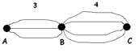
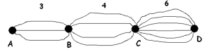
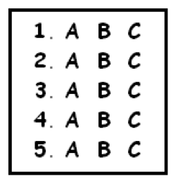
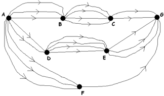

# 2.1 ШАГ ПЕРВЫЙ: Принцип умножения

> Source: [gdaymath.com](https://gdaymath.com/lessons/perms-1/multiplication-principle/)

Начнем с маленькой головоломки:

*Существует три главных шоссе от Аделаиды до Брисбена и четыре главных шоссе от Брисбена до Канберры.*

*Сколько разных маршрутов можно выбрать, чтобы добраться из Аделаиды в Канберру, двигаясь на этой схеме всегда на восток?*

**МОМЕНТ ДЛЯ РАЗМЫШЛЕНИЯ:** Ответ 7 (из 3 + 4) или ответ 12 (из 3 × 4)? Что здесь уместно: сложение или умножение?

Один из способов подумать об этом — сказать, что для каждого выбора маршрута из A в B (верхний, средний или нижний) есть четыре варианта, которыми можно завершить путешествие в C. Таким образом, у нас есть всего 4 + 4 + 4 возможных путешествия: три группы по четыре. Это повторяющееся сложение (которое является умножением для натуральных чисел) показывает, что правильным ответом является умножение, 3 × 4. Всего существует 12 возможных маршрутов из A в C.

Давайте немного усложним задачу:

*Предположим, есть также шесть главных шоссе от Канберры до Дарвина.*

*Сколько различных маршрутов существует из A в D?*

Четко осознайте, что ответ правильно дается умножением: 3 × 4 × 6 = 72. (Для каждого из двенадцати маршрутов из A в C у нас есть шесть вариантов завершения путешествия. Это двенадцать групп по шесть.)

**Упражнение 1:** У меня есть пять разных рубашек, четыре разные пары брюк и две пары обуви. В скольких разных нарядах вы можете меня увидеть?

**Упражнение 2:** В кинотеатре я могу выбрать один из десяти фильмов и одну из десяти закусок. Сегодня вечером я иду в кино и буду есть закуску. Сколько всего у меня вариантов комбинации фильм/закуска?

Все ответы к упражнениям находятся в СОПУТСТВУЮЩЕМ РУКОВОДСТВЕ к этому курсу "Перестановки и сочетания".

У нас есть общий принцип:

**ПРИНЦИП УМНОЖЕНИЯ:** *Если существует a способов выполнить первую задачу и b способов выполнить вторую задачу, и никакой исход первой задачи никак не влияет на выбор исхода второй, то существует a × b способов выполнить обе задачи как пару.*

Этот принцип легко распространяется на выполнение более чем одной задачи.

**Упражнение 3:** Объясните условие, указанное в середине принципа умножения. Что может произойти, если разные результаты первой задачи повлияют на выбор, доступный для второй задачи? Приведите конкретный пример.

**ПРИМЕР:** *В тесте с множественным выбором пять вопросов, в каждом из которых три варианта ответа:*

*Я решаю заполнять ответы случайным образом. Сколькими различными способами я мог бы заполнить тест?*

**Ответ:** Это процесс из пяти задач:

*   Задача 1: Ответить на первый вопрос: 3 способа
*   Задача 2: Ответить на второй вопрос: 3 способа
*   Задача 3: Ответить на третий вопрос: 3 способа
*   Задача 4: Ответить на четвертый вопрос: 3 способа
*   Задача 5: Ответить на пятый вопрос: 3 способа

Согласно принципу умножения, существует 3 × 3 × 3 × 3 × 3 = 3⁵ способов заполнить тест.

Вот и все, что можно сказать об этом первом шаге в подсчете!

## НЕМНОГО ПРАКТИКИ

Опять же, все ответы есть в СОПУТСТВУЮЩЕМ РУКОВОДСТВЕ к этому курсу.

**Упражнение 4:** В тесте с множественным выбором 10 вопросов, в каждом из которых 4 различных возможных ответа. Сколькими способами можно заполнить тест?

**Упражнение 5:** Десять человек баллотируются на выборах. Сколькими способами можно заполнить бюллетень для выбора «президента» и «вице-президента»?

**Упражнение 6:** Сколькими способами я могу выстроить шесть человек в ряд?

**Упражнение 7:** Сколькими способами можно записать три гласные буквы по порядку слева направо? Как изменится ответ, если мы будем настаивать на том, чтобы все гласные были разными?

**Упражнение 8:** Сколько различных путей существует из A в G?

