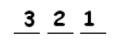
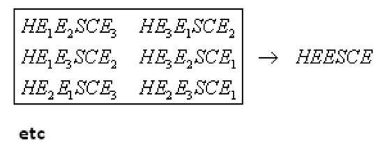
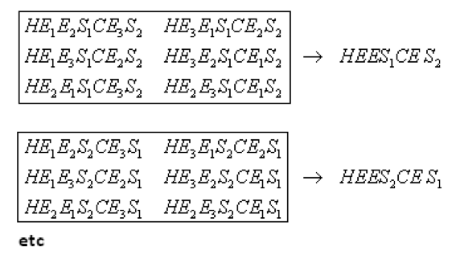
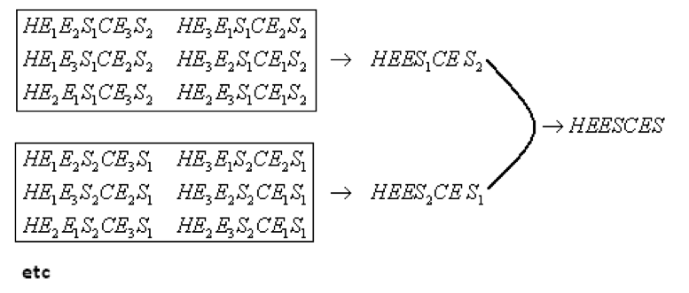

# 2.2 ШАГ ВТОРОЙ: Игры со словами

> Source: [gdaymath.com](https://gdaymath.com/lessons/perms-1/1-2-word-games/)

Меня зовут ДЖИМ (JIM). Сколькими способами я могу переставить буквы своего имени?

**Ответ 1:** Мы могли бы просто перечислить все способы. (Это называется метод *грубой силы*!)

    JIM     MJI     IJM
    JMI     MIJ     IMJ

Всего шесть способов.

**Ответ 2:** Используем принцип умножения: У нас есть три слота для заполнения:

___   ___   ___

*   Первая задача — заполнить первый слот буквой. Есть 3 способа выполнить эту задачу.
*   Вторая задача — заполнить второй слот. Есть 2 способа выполнить эту задачу. (Как только первый слот заполнен, остается только два варианта букв для второго слота.)
*   Третья задача — заполнить третий слот. Есть только 1 способ выполнить эту задачу (как только слоты один и два заполнены).

По принципу умножения, существует $3 \times 2 \times 1 = 6$ способов выполнить эту работу.

На самом деле, мое полное имя ДЖЕЙМС (JAMES). Сколькими способами можно переставить буквы моего настоящего имени?

**Ответ:** Метод грубой силы на этот раз был бы не очень веселым. Но если мы подумаем об этом как о задаче подсчета с пятью этапами — поместить первую букву, поместить вторую букву и так далее — мы увидим, что должно быть $5 \times 4 \times 3 \times 2 \times 1 = 120$ перестановок букв слова JAMES.

**Упражнение 9:** Сколькими способами можно переставить буквы слова BOVINE?

**Упражнение 10:** Сколькими способами можно переставить буквы слова FACETIOUSLY? (Что необычного в гласных этого слова? Найдите другое слово в английском языке с таким свойством!)

При работе с этими задачами становится ясно, что необходимо следующее определение:

**Определение:** Для данного натурального числа $N$, произведение целых чисел от $1$ до $N$ называется *факториалом* и обозначается $N!$.

Эти факториальные числа растут очень быстро:

$1! = 1$
$2! = 2 \times 1 = 2$
$3! = 3 \times 2 \times 1 = 6$
$4! = 4 \times 3 \times 2 \times 1 = 24$
$5! = 5 \times 4 \times 3 \times 2 \times 1 = 120$
$6! = 6 \times 5 \times 4 \times 3 \times 2 \times 1 = 720$
$7! = 7 \times 6 \times 5 \times 4 \times 3 \times 2 \times 1 = 5040$
$8! = 8 \times 7 \times 6 \times 5 \times 4 \times 3 \times 2 \times 1 = 40320$

(Имеет ли данное определение смысл для $1!$? Вас не смущает, что я записываю произведения от $N$ до $1$ вместо от $1$ до $N$?)

Какой первый факториал больше миллиона? Миллиарда?

НА КАЛЬКУЛЯТОРЕ функция факториала обычно спрятана в меню PROBABILITY (ВЕРОЯТНОСТЬ).

Какой самый большой факториал может вычислить ваш калькулятор?

Факториалы возникают как ответы на задачи перестановки слов. Например, существует $6 \times 5 \times 4 \times 3 \times 2 \times 1 = 6!$ способов переставить буквы слова BOVINE.

Пока все отлично. Мы можем переставлять буквы в JIM, JAMES и других словах. Но нам повезло. Что, если бы мое имя было БОБ (BOB)? Как бы мы справлялись с повторяющимися буквами?

**Упражнение 11:** Сколькими способами можно переставить буквы слова BOB? Предположим, что буквы B неразличимы. Сколькими способами можно переставить буквы слова ABBA?

Ответьте на упражнение 11. Это можно легко сделать методом грубой силы. Как вы думаете, может быть другой способ решения этой проблемы?

Сколькими способами можно переставить буквы слова HOUSES?

Попробуйте ответить и на этот вопрос. Кажется ли перечисление всех возможностей увлекательным занятием?

Вот один из способов подумать об этой задаче…

**ПОДХОД 1:** Подумайте об этом как о пятиэтапной задаче.

У нас есть шесть слотов:  _  _  _  _  _  _.

*   Задача 1: Назначить букву H в слот.
    Есть $6$ способов выполнить эту задачу.
*   Задача 2: Назначить букву O в слот.
    С буквой H на месте, есть $5$ способов выполнить эту задачу.
*   Задача 3: Назначить букву U в слот.
    С буквами H и O на месте, есть $4$ способа выполнить эту задачу.
*   Задача 4: Назначить букву E в слот.
    Есть $3$ способа выполнить эту задачу.
*   Задача 5: Назначить две буквы S в слоты.
    Поскольку осталось только два слота, есть только $1$ способ выполнить эту задачу.

По принципу умножения существует $6 \times 5 \times 4 \times 3 \times 1$ перестановок букв слова HOUSES.

Этот подход работает хорошо, по крайней мере для HOUSES. Однако он не очень полезен для слов (имен), таких как ABBA и MISSISSIPPI. (Попробуйте!)

Позвольте мне предложить второй подход, который прекрасно обобщается. Он использует полезную стратегию в решении задач:

**МОГУ ЛИ Я ПРЕОБРАЗОВАТЬ ЗАДАЧУ ВО ЧТО-ТО, ЧТО Я РЕШАЛ РАНЬШЕ?**

**ПОДХОД 2:** Проблема с HOUSES в том, что в нем есть повторяющиеся буквы. Что, если бы в нем не было повторяющихся букв? Предположим, что буквы S были бы различимы, записанные, скажем, как $S_1$ и $S_2$. Тогда на задачу легко ответить:

Существует $6!$ способов переставить буквы $HOUS_1ES_2$.

Список перестановок мог бы начинаться так:

$HOUS_1ES_2$
$HOUS_2ES_1$
$OHUS_1S_2E$
$OHUS_2S_1E$
$S_1S_2UEOH$
$S_2S_1UEOH$
и т.д.

Но заметьте, если S больше не различимы, то пары в этом списке ответов «схлопываются», давая одну и ту же перестановку. Мы должны изменить наш ответ на коэффициент два, и поэтому количество перестановок слова HOUSES равно:

$\dfrac{6!}{2!}=360.$ 

Это согласуется с ответом $6 \times 5 \times 4 \times 3 \times 1$.

Сколькими способами можно переставить буквы слова CHEESE?

**Ответ:** Если три буквы E различны — записаны как $E_1$, $E_2$ и $E_3$, скажем — то существует $6!$ способов переставить буквы $CHE_1E_2S E_3$. Но три буквы E можно переставить $3! = 6$ различными способами внутри любой конкретной расстановки букв. Эти шесть расстановок будут выглядеть одинаково, если буквы E больше не будут различаться:

Таким образом, мы должны разделить наш ответ $6!$ на $3!$, чтобы учесть группы из шести, которые становятся идентичными. Таким образом, существует $\dfrac{6!}{3!} = \dfrac{6 \cdot 5 \cdot 4 \cdot 3 \cdot 2 \cdot 1}{3 \cdot 2 \cdot 1} = 6 \cdot 5 \cdot 4 = 120$ способов переставить буквы слова CHEESE.

**КОММЕНТАРИЙ:** Количество способов переставить буквы HOUSES равно $\dfrac{6!}{2!}$. «2» в знаменателе — это на самом деле $2!$.

Объясните, почему количество способов переставить буквы слова CHEESES равно $\dfrac{7!}{3!2!}$.

**Ответ:** Если бы буквы E были различимы и буквы S были различимы, то мы бы считали способы переставить семь различных букв:

*Существует $7!$ способов переставить буквы $CHE_{1}E_{2}S_{1}E_{3}S_{2}$.*

Как и раньше, существует $3!$ способов переставить буквы E в любой конкретной конфигурации. Эти группы по $3!$ «схлопнутся» в одну перестановку, если мы уберем индексы у букв E.

Но эти новые перестановки также схлопываются парами, как только мы убираем индексы у букв S.

Поэтому нам нужно взять наш ответ $7!$ и разделить его на $3!$ и снова на $2!$:

$\dfrac{7!}{3!} \div 2!$.

**УБЕДИТЕСЬ, ЧТО ВЫ ПОНИМАЕТЕ, ПОЧЕМУ ЭТО РАВНО $\dfrac{7!}{3!2!}$.**

(что гораздо легче читать!)

**Упражнение 12:** Сколькими способами можно переставить буквы CHEEEEESIESSTT? (Убедитесь, что вы понимаете, почему ответ $\dfrac{14!}{6!3!2!}$).