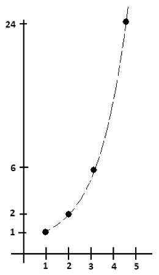

# 2.3 ОТСТУПЛЕНИЕ: Смысл 0

> Source: [gdaymath.com](https://gdaymath.com/lessons/perms-1/1-3-aside-making-sense-0/)

Рассмотрим «слово» CHEESIESTESSNESS, свойство быть самым сырным из сыров. Видите ли вы, что существует $\dfrac{16!}{5!6!}$ способов переставить его буквы?

**Упражнение 13:** Вычислите это число.

Это может показаться странным, но на самом деле лучше записать этот ответ так:
$\dfrac{16!}{1!1!5!6!1!1!1!}$

$1!$ для одной буквы C
$1!$ для одной буквы H
$5!$ для пяти букв E
$6!$ для шести букв S
$1!$ для одной буквы I
$1!$ для одной буквы T
$1!$ для одной буквы N

Это позволяет сделать самопроверку: числа в знаменателе должны в сумме давать число в числителе.

**Вопрос:** Вернемся к $1!$. Имеет ли определение факториала смысл для $1!$? В этом контексте мы хотим, чтобы $1!$ был равен единице, чтобы значение знаменателя оставалось $5!6!$. Так что, возможно, математика здесь подсказывает нам, что мы должны принять $1!=1$.

**Упражнение 14:** Сколькими способами вы можете переставить буквы вашего полного имени?

Продолжаем с CHEESIESTESSNESS …

Мы записали формулу для количества способов перестановки его букв как:
$\dfrac{16!}{1!1!5!6!1!1!1!}$
с одним множителем в знаменателе для количества каждой буквы в слове.

Хмм. Поскольку в этом слове нет букв P, должны ли мы записать эту формулу как: $\dfrac{16!}{1!1!5!6!1!1!1!0!}$ ?
Также нет букв Q и M: $\dfrac{16!}{1!1!5!6!1!1!1!0!0!0!}$.

Величина $0!$ на самом деле не имеет смысла, но какое значение мы, как общество, могли бы присвоить ей, чтобы приведенные выше формулы по-прежнему имели смысл и были правильными?

**Упражнение 15:** Вычислите следующие выражения:
а) $\dfrac{800!}{799!}$ б) $\dfrac{15!}{13!2!}$ в) $\dfrac{87!}{89!}$ г) $\dfrac{0!}{0!}$

Все ответы есть в СОПУТСТВУЮЩЕМ РУКОВОДСТВЕ к этому курсу по Перестановкам и Сочетаниям.

**Упражнение 16:** Значительно упростите следующие выражения:
а) $\dfrac{N!}{N!}$ б) $\dfrac{N!}{(N-1)!}$ в) $\dfrac{n!}{(n-2)!}$ г) $\dfrac{1}{k+1} \cdot \dfrac{(k+2)!}{k!}$ д) $\dfrac{n!(n-2)!}{((n-1)!)^2}$

## 2.4 ОТСТУПЛЕНИЕ: Леонард Эйлер и Факториалы

> Source: [gdaymath.com](https://gdaymath.com/lessons/perms-1/1-4-aside-leonhard-euler-factorials/)

Имеем:

$1!=1$
$2!=2 \times 1=2$
$3!=3 \times 2 \times 1=6$
$4!=4 \times 3 \times 2 \times 1=24$
$5!=5 \times 4 \times 3 \times 2 \times 1=120$
$6!=6 \times 5 \times 4 \times 3 \times 2 \times 1=720$
$7!=7 \times 6 \times 5 \times 4 \times 3 \times 2 \times 1=5040$
$8!=8 \times 7 \times 6 \times 5 \times 4 \times 3 \times 2 \times 1=40320$

График этих значений выглядит следующим образом:

В 1729 году, в возрасте 22 лет, швейцарский математик Леонард Эйлер задался вопросом, существует ли формула для общей функции, которая «соединяет точки» факториальных чисел. И он нашел её! Он назвал её _Гамма-функцией_.

Любопытно то, что в Гамма-функцию можно вводить рациональные и иррациональные значения и получать осмысленные ответы. Гамма-функция дает $1!=1$ и $0!=1$ (как и предполагала математика, которую мы видели ранее), а также дает:

$\\left(\\dfrac{1}{2}\\right)! = \\dfrac{\\sqrt{\\pi}}{2}$.

С ума сойти!
