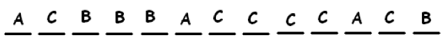

# 2.5 ШАГ ТРЕТИЙ: Принцип маркировки

> Source: [gdaymath.com](https://gdaymath.com/lessons/perms-1/1-3-labeling-principle/)

Сколькими способами мы можем переставить буквы названия шведской поп-группы ABBA?
Ответ: $\dfrac{4!}{2!2!} = \dfrac{24}{4} = 6$.

Сколькими способами мы можем переставить буквы слова AABBBBA?
Ответ: $\dfrac{7!}{3!4!}$.

Сколькими способами мы можем переставить буквы слова AAABBBBCCCCCC?
Ответ: $\dfrac{13!}{3!4!6!}$.

Давайте посмотрим на эту третью задачу и сформулируем ее по-другому:

Злой мистер Макинс ведет класс из 13 учеников. Он решил случайным образом поставить оценку A трем ученикам, оценку B — четырем ученикам и оценку C — шести ученикам. Сколькими способами он может распределить эти оценки (метки)?

**Ответ:** Давайте представим, что все тринадцать учеников стоят в ряд.

Вот один из способов, как он может назначить оценки:

Вот другой способ:

и так далее.

Мы видим, что эта задача о распределении оценок (маркировке) — это та же самая задача, что и перестановка букв. Ответ должен быть $\dfrac{13!}{3!4!6!}$.

Из 10 человек в офисе нужно выбрать 4 для комитета. Сколькими способами это можно сделать?

**Ответ:** Представьте, что 10 человек стоят в ряд. Нам нужно раздать метки. Четыре человека получат метку «В КОМИТЕТЕ» (ON), а шесть человек — «СЧАСТЛИВЧИК» (LUCKY). Вот один из способов назначить эти метки:

Мы видим, что это просто задача о перестановке букв. Ответ:

$\dfrac{10!}{4!6!} = \dfrac{10 \cdot 9 \cdot 8 \cdot 7}{4 \cdot 3 \cdot 2 \cdot 1} = 10 \cdot 3 \cdot 7 = 210$.

В общем случае имеем…

**ПРИНЦИП МАРКИРОВКИ**

Каждому из $N$ различных объектов нужно присвоить метку. Если $a$ из них должны иметь метку «1», $b$ из них — метку «2» и так далее, то общее количество способов присвоения меток равно:

$\dfrac{N!}{a!b! \cdots z!}$.

Вот и всё. Мы просто переставляем буквы, где буквами являются названия меток.
