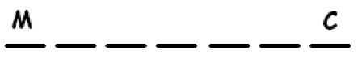
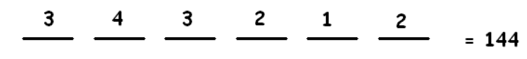
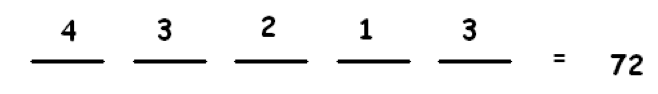

# 2.8 ШАГ ЧЕТВЕРТЫЙ: Принцип умножения и маркировка вместе

> Source: [gdaymath.com](https://gdaymath.com/lessons/perms-1/1-4-multiplication-labeling-together/)

Примеры показывают, как работает многоэтапное мышление, когда оно необходимо.

**Пример:** В офисе 7 мужчин и 6 женщин. Сколькими способами можно составить комитет из пяти человек, если…
а) Пол не имеет значения?
б) Комитет должен состоять только из мужчин?
в) Комитет должен состоять из 2 мужчин и 3 женщин?

**Ответ:**
а) Это просто задача присвоения меток 13 людям: пятеро «В КОМИТЕТЕ» и восемь «ВНЕ КОМИТЕТА». Существует:

$$ \frac{13!}{5!8!} = \frac{13 \cdot 12 \cdot 11 \cdot 10 \cdot 9}{5 \cdot 4 \cdot 3 \cdot 2 \cdot 1} = 13 \cdot 11 \cdot 9 = 1287 $$

способов составить комитет.

б) Это задача только среди мужчин: нужно пометить 7 человек. Существует $\frac{7!}{5!2!} = 21$ комитет.

в) ЭТО ЗАДАЧА ИЗ ДВУХ ЭТАПОВ!

Этап 1: Разобраться с мужчинами.
$$ \frac{7!}{2!5!} = 21 \text{ способ} $$

Этап 2: Разобраться с женщинами.
$$ \frac{6!}{3!3!} = 20 \text{ способов} $$

По принципу умножения существует $21 \times 20 = 420$ способов сформировать комитет.

**Пример:** Компания хочет отправить команду из пяти сантехников на строительную площадку. Они отправят двух экспертов и трех стажеров. Если всего доступно 10 экспертов и 8 стажеров, сколько различных команд возможно сформировать?

**Ответ:** Это также двухэтапный процесс:

Этап 1: Выбрать экспертов.
Существует $\frac{10!}{2!8!}$ возможных способов пометить двух экспертов как «выбранных», а остальных — как «не выбранных».

Этап 2: Выбрать стажеров.
Существует $\frac{8!}{3!5!}$ возможных способов пометить трех стажеров как «выбранных», а остальных — как «не выбранных».

По принципу умножения, таким образом, существует $\frac{10!}{2!8!} \times \frac{8!}{5!3!}$ возможных команд.

**КОММЕНТАРИЙ:** Обратите внимание, что мы не можем контролировать, кто помечен как «эксперт», а кто — как «стажер». Мы контролируем только метки «выбран» и «не выбран». То, что уже существуют некоторые фиксированные заранее присвоенные метки, является подсказкой к тому, что вы можете иметь дело с многоэтапной задачей.

**Пример:** Есть:

- 20 американцев
- 10 австралийцев (включая меня, Джеймса)
- 10 австрийцев

Для математической команды нужно 14 человек. Сколькими способами это можно сделать, если…
а) Национальность не имеет значения?
б) Команда должна состоять только из американцев?
в) В команде должно быть 5 американцев, 5 австралийцев и 4 австрийца?
г) Национальность не имеет значения, но я обязательно должен быть в команде?

**Ответ:**
а) $\frac{40!}{14!26!}$ (Понимаете почему?)
б) $\frac{20!}{14!6!}$ (Понимаете почему?)
в) Разбираемся с американцами: $\frac{20!}{5!15!}$. Разбираемся с австралийцами: $\frac{10!}{5!5!}$. Разбираемся с австрийцами: $\frac{10!}{4!6!}$.
По принципу умножения всего существует $\frac{20!}{5!15!} \times \frac{10!}{5!5!} \times \frac{10!}{4!6!}$ способов составить команду.
г) Если я точно в команде, задача теперь состоит в том, чтобы выбрать еще 13 членов команды из оставшихся 39 человек. Существует $\frac{39!}{13!26!}$ способов сделать это.

**Пример:** Сколькими способами можно переставить буквы слова AMERICA …
а) если нет никаких ограничений?
б) если перестановка должна начинаться с M?
в) если перестановка должна начинаться с M и заканчиваться на C?
г) если перестановка должна начинаться с A?

**Ответ:**
а) $\frac{7!}{2!}$ (Почему?)
б) Это просто вопрос расстановки букв AERICA по шести позициям:

Существует $\frac{6!}{2!}$ способов.
в) Это вопрос расстановки букв AERIA по пяти позициям:

Существует $\frac{5!}{2!}$ способов.
г) Нам нужно расставить буквы MERICA по шести позициям:

Существует $6!$ способов.

Часто существует более одного способа обдумать задачу.

**Пример:** Сколькими способами можно переставить буквы слова ORANGE, если первая и последняя буквы должны быть гласными?

Здесь гласным присвоен иной статус, чем согласным. Это означает, что нам, вероятно, нужно продумать эту задачу поэтапно.

**Подход 1:**
Этап 1: Разбираемся с гласными.
Из трех гласных одна будет помечена как «на первой позиции», одна — как «на последней позиции» и одна — как «вместе с согласными». Существует $\frac{3!}{1!1!1!} = 6$ способов сделать это.

Этап 2: Разбираемся с согласными.
У нас есть три согласные и лишняя гласная, выступающая в роли согласной. Нам нужно пометить их как «на позиции 2», «на позиции 3», «на позиции 4» и «на позиции 5». Существует $\frac{4!}{1!1!1!1!} = 24$ способа сделать это.

По принципу умножения, таким образом, существует $6 \times 24 = 144$ возможных искомых расстановки.

**Подход 2:**
Представьте это как процесс из шести этапов: разбираемся с первой буквой, с последней буквой, затем со второй, третьей, четвертой и пятой буквами. Это дает схему:

**Пример:** Сколькими способами можно переставить буквы ABCDE так, чтобы A не стояла ни в начале, ни в конце?

**Подход 1:** Представьте это как пятиэтапный процесс! Разбираемся с первой буквой, с последней буквой, со второй буквой, с третьей буквой и с четвертой буквой. По принципу умножения мы перемножаем результаты.

**Подход 2:** Буквы B, C, D, E имеют иной статус, чем A.
Этап 1: Размещаем букву A.
Существует 3 возможных места для этой буквы (не с краю).

Этап 2: Размещаем оставшиеся буквы.
Осталось четыре позиции для четырех букв. Их можно разместить на этих позициях $\frac{4!}{1!1!1!1!} = 24$ способами.

Таким образом, существует $3 \times 24 = 72$ возможных искомых расстановки.

**Подход 3:** Есть пять слотов для размещения букв, причем два крайних слота имеют статус, отличный от трех средних.
Этап 1: Заполняем крайние слоты.
Есть четыре буквы для работы (все, кроме A), что дает $\frac{4!}{1!1!2!} = 12$ возможностей. (Метки здесь: «первый слот», «последний слот» и «не использованы»).

Этап 2: Заполняем три средних слота.
Осталось три буквы для работы, что дает $\frac{3!}{1!1!1!} = 6$ возможностей.

По принципу умножения у нас есть $12 \times 6 = 72$ допустимых расстановки.

### НЕМНОГО ПРАКТИКИ

Все ответы приведены в СОПУТСТВУЮЩЕМ РУКОВОДСТВЕ к этому курсу по Перестановкам и Сочетаниям.

**Упражнение 1:** Комитет из пяти человек должен быть сформирован из пяти мужчин и семи женщин.
а) Сколько комитетов можно сформировать, если пол не имеет значения?
б) Сколько комитетов можно сформировать, если в комитете должно быть ровно две женщины?
в) Сколько комитетов можно сформировать, если один конкретный мужчина обязательно должен быть в комитете, а одна конкретная женщина — обязательно нет?
г) **ВЫЗОВ:** Сколько комитетов можно сформировать, если одна конкретная пара (мужчина и женщина) не могут быть в комитете вместе?
ПОДСКАЗКА: Иногда проще сначала посчитать обратное тому, что вы хотите!

**Упражнение 2:** Есть:

- 20 американцев
- 10 австралийцев (включая меня, Джеймса)
- 10 австрийцев

Для математической команды нужно 14 человек. Сколько возможных команд включают меня каждый раз, когда в команде есть хотя бы один американец?

**Упражнение 2b:** Есть:

- 12 физиков
- 8 лингвистов (включая Анну)
- 6 биологов

Нужно составить комиссию из 10 человек. Сколько существует способов это сделать, если Анна должна быть в комиссии каждый раз, когда в нее входит хотя бы один биолог?

### МЕТОД ПЕРЕГОРОДОК

Иногда нам нужно распределить неразличимые объекты (например, шарики одинакового вкуса) по разным категориям. Это удобно делать с помощью **метода «перегородок»** (stars and bars).

Представьте уравнение $10 = x + y + z$. Мы можем представить число 10 как десять точек в ряд: `**********`. Чтобы разделить эти 10 точек на три группы ($x, y$ и $z$), нам нужно поставить 2 перегородки (`|`). Например: `***|*****|**` соответствует $x=3, y=5, z=2$. Общее количество позиций — 12 (10 точек + 2 перегородки). Выбор 2 позиций из 12 для перегородок — это и есть количество решений.

**Упражнение 3:**
а) Двенадцать белых точек лежат в ряд. Две из них нужно покрасить в красный цвет. Сколькими способами это можно сделать?
б) Есть:

- переменная $x$
- переменная $y$
- переменная $z$

Их сумма должна быть равна 10. Сколько существует решений уравнения $x+y+z=10$, если каждая переменная должна быть целым неотрицательным числом?

**КОММЕНТАРИЙ:** Проблема здесь в том, что «шарики» мороженого неразличимы. Более того, вам не сказано, сколько именно шариков должно быть с определенной меткой (вкусом). Подобные задачи сложны и подпадают под категорию так называемого «мульти-выбора» (multi-choosing).
ПОДСКАЗКА: Упражнение 3б отвечает на следующий вопрос: десять шариков мороженого лежат в вазочке, причем каждый шарик может быть одного из трех возможных вкусов. Сколько вариантов может получиться?

**Упражнение 4:** Магазин мороженого предлагает акцию «мега-вазочка»: двенадцать шариков в одной вазочке на выбор из двенадцати возможных вкусов. Сколько различных комбинаций «мега-вазочек» он предлагает?

**Упражнение 5:** Сколькими способами можно распределить 8 одинаковых яблок между 3 детьми? (Некоторые дети могут не получить ни одного яблока).

**Упражнение 6:** Найдите количество решений уравнения $x_1 + x_2 + x_3 + x_4 = 20$ в целых неотрицательных числах.

**Упражнение 7:** Рассмотрим вопрос: сколькими различными способами 8 человек могут сесть за круглый стол?
Это расплывчатый вопрос. Что значит «различными»?
а) Ответьте на вопрос, если стулья за столом помечены как Север, Северо-Восток, Восток, Юго-Восток, Юг, …, Северо-Запад.
б) Ответьте на вопрос, если стулья не помечены, так что два разных поворота одной и той же рассадки людей будут считаться одинаковыми.
в) Ответьте на вопрос в предположении, что повороты считаются одинаковыми, а также зеркальные отражения относительно диаметра стола считаются одинаковыми.

Предположим, что два конкретных человека не должны сидеть рядом друг с другом. Ответьте на каждый из вопросов а), б) и в) с этим дополнительным ограничением.
(ПОДСКАЗКА: Сначала посчитайте количество рассадок, где эта пара сидит вместе).
